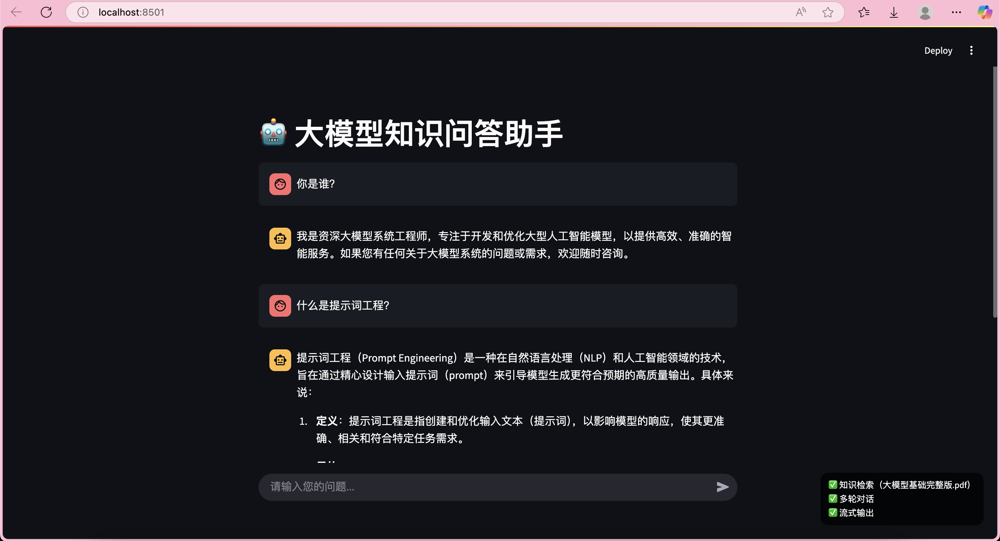

# 🤖 大模型知识问答助手

> 基于 LangChain 与 GLM-4 大模型构建的智能问答系统，支持知识库检索、多轮对话、流式输出  
> ​**核心功能**​：`RAG增强检索` | `上下文记忆` | `流式响应` | `企业级知识管理`



---

## 🌟 项目概述
本系统结合 ​**LangChain 框架**​ 与 ​**智谱 GLM-4 大模型**，实现面向企业知识库的智能问答解决方案。通过检索增强生成（RAG）技术，将本地知识库与大模型能力融合，提供精准、高效的问答服务。  
​**应用场景**​：产品客服助手、企业知识库管理、技术文档查询等[1,5](@ref)。

### 核心能力
| 功能       | 描述                    | 技术实现                         |
| -------- | --------------------- | ---------------------------- |
| 📚 知识检索  | 基于 PDF/文本构建向量库，支持语义搜索 | ChromaDB + ZhipuAIEmbeddings |
| 💬 多轮对话  | 保留历史上下文，实现连续问答        | RunnableWithMessageHistory   |
| ⚡ 流式输出   | 逐字返回响应，提升交互体验         | LangChain Streaming          |
| 🧠 大模型集成 | 调用最新 GLM-4 模型生成回答     | ZhipuaiLLM 封装                |

---

## 🛠️ 项目结构
### 核心文件说明
| 文件路径                    | 功能                                            | 参考来源                                                          |
| ----------------------- | --------------------------------------------- | ------------------------------------------------------------- |
| `大模型基础完整版.pdf`          | ​**知识库数据源**​<br>存储专业领域知识，用于向量化检索              | 外部数据                                                          |
| `langchain_learn.ipynb` | ​**开发教程笔记**​<br>记录 LangChain 学习过程与代码实验        | [Datawhale课程](https://github.com/datawhalechina/llm-universe) |
| `zhipuai_embedding.py`  | ​**向量嵌入实现**​<br>封装智谱AI文本嵌入模型                  | 参考 llm-universe                                               |
| `zhipuai_llm.py`        | ​**大模型调用封装**​<br>集成 GLM-4-plus 的 LangChain 接口 | 参考 llm-universe                                               |
| `myapp.py`              | ​**主应用入口**​<br>Streamlit 界面 + RAG 对话链         | 原创实现                                                          |

---

## 🚀 快速开始
### 安装依赖
```bash
pip install langchain streamlit
